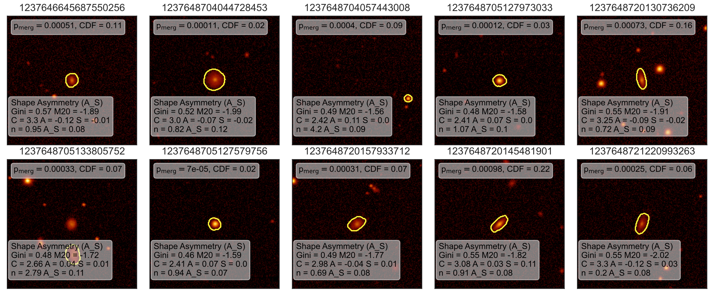
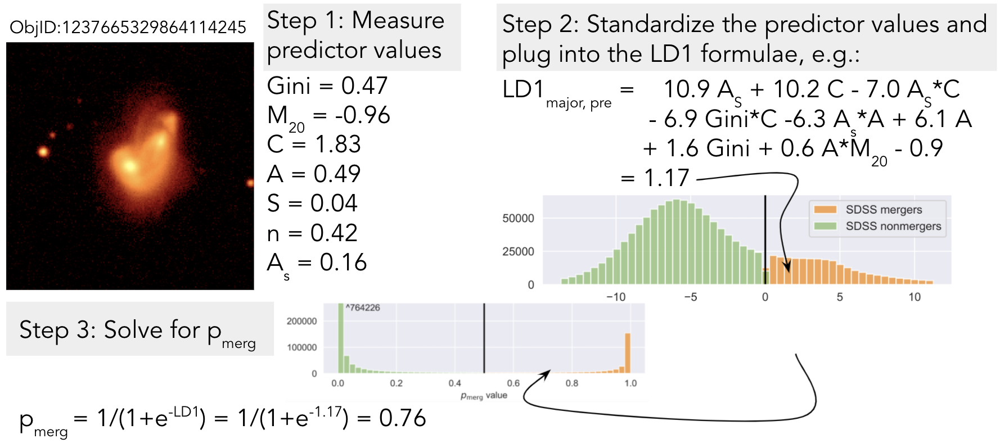

### MergerMonger: Identify different types of mergers in SDSS imaging

Based on the imaging classification presented in Nevin+2019 and Nevin+2022.

There are three main steps:
## 1) Creating the classification from simulations of merging galaxies:


The simulations are fully described in Nevin+2019.

```
code example

```

## 2) Measure predictor values from images (GalaxySmelter):
I also include some utilities for visualizing individual galaxies and their predictor values.


## 3) Classify galaxies and obtain merger probability values:


I also include some utilities for interpreting these probability values using the CDF of the full population.
